# 📊 Flows Feature Documentation

## Overview

The **Flows Feature** is an optional enhancement to the Transcript to Exam Notes Pipeline that generates visual diagrams and flowcharts from the extracted workflow data in your lecture summaries. This feature helps visualize multi-step processes, making it easier for students to understand complex procedures and relationships between concepts.

## Purpose

The flows feature serves several key purposes:

1. **Process Visualization**: Converts step-by-step workflows extracted from summaries into visual flowcharts
2. **Pipeline Transparency**: Shows the 4-stage pipeline execution flow with cost and processing information
3. **Study Aid Enhancement**: Provides multiple diagram formats (Mermaid, ASCII) for different use cases
4. **Output Organization**: Generates neat, well-organized flows in the output directory for easy browsing

## Key Features

### 1. **Mermaid Flowcharts**
- Generates interactive flowcharts in Mermaid syntax (compatible with GitHub, GitLab, Notion, etc.)
- Each step is clearly labeled with emoji icons (🚀 Start, → Steps, ✓ Complete)
- Supports step-by-step flow visualization
- Notes and additional information displayed as dotted connections

### 2. **ASCII Art Diagrams**
- Terminal-friendly text-based flowcharts
- Perfect for viewing in terminal, email, or plain text documents
- Beautiful box-drawing characters for professional appearance
- Step numbering and clear separation for readability

### 3. **Pipeline Diagram**
- Visual representation of all 4 pipeline stages
- Shows data flow: Transcripts → Chunks → Summaries → Master Notes → Exam Materials
- Indicates which stages require API calls
- Cost information per stage

### 4. **Workflow Reference Table**
- Comprehensive table of all extracted workflows
- Lists workflow name, step count, and source chunk
- Helps identify and navigate workflows in the report

### 5. **Individual Workflow Files**
- Each workflow gets its own markdown file
- Contains step-by-step list, flowchart, and ASCII diagram
- Named based on workflow name for easy identification

## Architecture

### Components

#### 1. **FlowsGenerator** (`com.transcript.pipeline.util`)
Utility class responsible for generating visual diagrams in different formats:

```java
// Generate Mermaid flowchart from a workflow
FlowsGenerator.generateMermaidFlowchart(workflow, index)

// Generate ASCII art representation
FlowsGenerator.generateAsciiFlowchart(workflow)

// Generate pipeline execution flow
FlowsGenerator.generatePipelineFlowDiagram()
FlowsGenerator.generatePipelineAsciiDiagram()

// Generate workflow table
FlowsGenerator.generateWorkflowTable(summaries)

// Generate complete report
FlowsGenerator.generateCompleteFlowsReport(summaries)
```

#### 2. **FlowsService** (`com.transcript.pipeline.services`)
Service layer that coordinates flows generation and file I/O:

```java
// Generate flows from chunk summaries
FlowsService.generateFlows(summaries, outputDir)

// Generate workflows ASCII text
FlowsService.generateWorkflowsAsciText(summaries)

// Check if flows exist
FlowsService.flowsExist(outputDir)

// Get flows directory path
FlowsService.getFlowsDir(outputDir)
```

#### 3. **ConsolidatorService Integration**
Added method to trigger flows generation:

```java
consolidatorService.generateAndSaveFlows(summaries, outputDir)
```

#### 4. **App.java Integration**
- Menu option 6: "Generate flows and diagrams (optional visualization)"
- Automatically runs after consolidation in complete pipeline
- Standalone mode available through menu option 6

## Usage

### Method 1: Automatic Generation (Recommended)
Flows are automatically generated at the end of the complete pipeline:

```bash
# Run interactive mode
java -jar target/transcript-pipeline.jar

# Choose option 1: Run complete pipeline
# Flows will be generated automatically after all stages
```

### Method 2: Standalone Generation
Generate flows from existing summaries:

```bash
# Run interactive mode
java -jar target/transcript-pipeline.jar

# Choose option 6: Generate flows and diagrams
# Enter the summaries directory when prompted
```

### Method 3: Programmatic Usage
```java
List<ChunkSummary> summaries = // ... load summaries
consolidatorService.generateAndSaveFlows(summaries, "output");
```

## Output Structure

### Directory Organization
```
output/
├── flows/                           (NEW - Flows directory)
│   ├── flows_report.md             (Main comprehensive report)
│   ├── pipeline_diagram.md         (Pipeline execution flow)
│   ├── workflow_protein_synthesis.md
│   ├── workflow_dna_replication.md
│   └── ...
├── chunks/
├── summaries/
├── consolidated/
│   └── master_notes.md
└── exam_materials/
```

### File Descriptions

1. **flows_report.md** (Main Report)
   - Complete overview of all flows and diagrams
   - Includes pipeline diagram, workflow table, and all individual workflows
   - Good entry point for understanding the entire flows structure

2. **pipeline_diagram.md**
   - Separate file with just the pipeline execution flow
   - Shows the 4-stage pipeline with Mermaid diagram and ASCII art
   - Useful for documentation and presentations

3. **workflow_*.md** (Individual Workflow Files)
   - One file per extracted workflow
   - Contains: title, source, notes, steps list, Mermaid diagram, ASCII diagram
   - Named based on workflow name (e.g., workflow_photosynthesis.md)

## Example Output

### Mermaid Flowchart

```mermaid
flowchart TD
    START_0["🚀 Start: Photosynthesis"]
    STEP_0_0["→ Light absorption by chlorophyll"]
    STEP_0_1["→ Electron transfer in thylakoids"]
    STEP_0_2["→ ATP and NADPH production"]
    STEP_0_3["✓ Calvin Cycle initiation"]
    END_0["✅ Complete"]

    START_0 --> STEP_0_0
    STEP_0_0 --> STEP_0_1
    STEP_0_1 --> STEP_0_2
    STEP_0_2 --> STEP_0_3
    STEP_0_3 --> END_0
```


### ASCII Flowchart
```
┌─────────────────────────────────────────────────────┐
│          Photosynthesis                             │
└─────────────────────────────────────────────────────┘
                          ↓
    ┌─────────────────────────────────────────────┐
    │ STEP  1: Light absorption by chlorophyll   │
    └─────────────────────────────────────────────┘
                          ↓
    ┌─────────────────────────────────────────────┐
    │ STEP  2: Electron transfer in thylakoids    │
    └─────────────────────────────────────────────┘
                          ↓
    ┌─────────────────────────────────────────────┐
    │ STEP  3: ATP and NADPH production           │
    └─────────────────────────────────────────────┘

    ✅ Workflow Complete
```

## Data Source: ChunkSummary.Workflow

The flows feature uses the `Workflow` class embedded in `ChunkSummary`:

```java
public static class Workflow implements Serializable {
    private String name;          // Workflow name
    private List<String> steps;   // Step-by-step instructions
    private String notes;         // Additional context
}
```

These workflows are extracted by the Claude API during the summarization stage and are now visualized by the flows feature.

## Configuration

The flows feature requires no additional configuration. It automatically uses:
- **Output Directory**: From `OUTPUT_DIR` config (default: `output`)
- **Flows Directory**: Automatically created as `output/flows/`
- **File Format**: Markdown with embedded Mermaid diagrams

## Advantages

### For Students
- ✅ Visual understanding of complex processes
- ✅ Multiple diagram formats for different learning styles
- ✅ Easy reference guide with step numbers
- ✅ Can be imported into study apps and tools

### For Educators
- ✅ Professional visualization of course content
- ✅ Automatic generation saves time
- ✅ Multiple format support (Mermaid, ASCII, Markdown)
- ✅ Shareable and portable outputs

### For Developers
- ✅ Modular design for easy customization
- ✅ Multiple format generators (Mermaid, ASCII, text)
- ✅ Extensible architecture for new diagram types
- ✅ Clean separation of concerns (Generator, Service, Integration)

## Workflow Diagram Rendering

### Online Tools
- **GitHub**: Mermaid diagrams render automatically in README and .md files
- **GitLab**: Full Mermaid support in markdown files
- **Notion**: Can embed Mermaid diagrams
- **Obsidian**: Supports Mermaid diagram visualization
- **Mermaid Live Editor**: https://mermaid.live for quick viewing

### Offline Viewing
- Open `.md` files with ASCII diagrams in any text editor
- Use markdown viewers (VS Code, Sublime Text, etc.)
- Convert to PDF using pandoc or markdown-pdf

## Integration with Other Features

### Automatic Integration
- Flows are generated **automatically** at the end of complete pipeline (optional)
- Uses existing `ChunkSummary` data (no new API calls)
- Adds minimal processing time (local generation only)

### Optional Nature
- Not required for pipeline completion
- Can be skipped or generated separately
- Non-blocking if generation fails

### Cost Impact
- **Zero additional API cost** - uses already-extracted workflows
- Only local processing (no API calls)
- Minimal disk space usage (~1-2 KB per workflow)

## Customization Options

### Adding New Diagram Formats
Extend `FlowsGenerator` to support new formats:

```java
public static String generateGraphvizDot(Workflow workflow) {
    // Generate Graphviz DOT format
}

public static String generateUmlSequence(Workflow workflow) {
    // Generate UML sequence diagram
}
```

### Styling and Colors
Mermaid diagrams can be customized in `generateMermaidFlowchart()`:

```java
sb.append("    style A fill:#e1f5ff,stroke:#01579b\n");
```

### ASCII Art Customization
Modify box-drawing characters in `generateAsciiFlowchart()` for different styles:

```java
sb.append("╔═══════════════════════════════════════════════════════╗\n"); // Different borders
sb.append("┏━━━━━━━━━━━━━━━━━━━━━━━━━━━━━━━━━━━━━━━━━━━━━━━━━━━━┓\n");
```

## Troubleshooting

### Issue: Flows not generating
**Solution**: Ensure summaries contain workflows. Check:
1. Summaries were created successfully
2. AI model extracted workflows (check summary JSON files)
3. Flows directory has write permissions

### Issue: Markdown not rendering
**Solution**: Use compatible viewer:
- GitHub: Works natively
- VS Code: Install Markdown Preview extension
- Online: https://mermaid.live

### Issue: ASCII diagrams look misaligned
**Solution**: Use monospace font and ensure terminal width is at least 70 characters

## Future Enhancements

Potential improvements for future versions:

1. **Graph Visualization**
   - Concept relationship graphs
   - Dependency diagrams
   - Knowledge maps

2. **Additional Formats**
   - PlantUML support
   - Graphviz DOT format
   - SVG output
   - PDF generation

3. **Interactive Features**
   - Clickable steps linking to master notes
   - Animated workflow playback
   - Step-by-step quizzes

4. **Analytics**
   - Workflow complexity metrics
   - Step count statistics
   - Processing time per workflow

## Summary

The Flows Feature enhances the Transcript to Exam Notes Pipeline by:
- 📊 **Visualizing** extracted workflows in multiple formats
- 📈 **Showing** pipeline execution flow with cost information
- 🎨 **Creating** professional diagrams for study and teaching
- ⚡ **Requiring** zero additional configuration
- 🆓 **Adding** no API costs (local generation only)

It's an optional feature that significantly enhances the utility of the pipeline outputs by providing visual representations that help students understand complex processes at a glance.

---

## Related Files

- **Implementation**: `src/main/java/com/transcript/pipeline/util/FlowsGenerator.java`
- **Service**: `src/main/java/com/transcript/pipeline/services/FlowsService.java`
- **Integration**: `src/main/java/com/transcript/pipeline/services/ConsolidatorService.java`
- **CLI**: `src/main/java/com/transcript/pipeline/App.java`
- **Architecture**: See `CLAUDE.md` for system design overview

---

_Last Updated: 2025-11-15_
_Version: 1.0 (Initial Release)_
